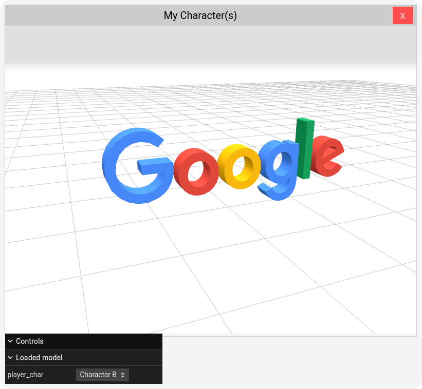

# AI Agents

[](https://opensource.org/licenses/Apache-2.0)
[](https://www.python.org/)
[](https://www.docker.com/)
[](https://www.terraform.io/)

**AI Agents** is an advanced project leveraging the power of [Google's Gemini 1.5 Pro and Gemini 1.5 Flash](https://developers.googleblog.com/en/gemini-15-pro-and-15-flash-now-available/) AI models. It offers:

* **[Function Calling](https://ai.google.dev/gemini-api/docs/function-calling):** Seamless integration of custom functions.
* **[RAG (Retrieval Augmented Generation)](https://cloud.google.com/vertex-ai/generative-ai/docs/llamaindex-on-vertexai):** Enhanced responses with external data context.
* **[Voice Transcribing](https://cloud.google.com/vertex-ai/generative-ai/docs/samples/generativeaionvertexai-gemini-audio-transcription):** Effortless conversion of spoken language to text.

Built with Python, it utilizes [AlloyDB](https://cloud.google.com/alloydb) when deployed to Google Cloud and [AlloyDB Omni](https://cloud.google.com/alloydb/omni) for local development.


## Features

* Cutting-edge AI (Gemini 1.5 Pro & Flash)
* Versatile capabilities (function calling, RAG, voice transcribing)
* Robust local storage (AlloyDB Omni)
* Streamlined deployment (Docker & Terraform)

## Getting Started

### Prerequisites

* Python 3.x
* Docker
* Terraform

### Local Setup

1. Clone this repository: `git clone git@github.com:NucleusEngineering/ai-agents.git`
2. Set environment variables:
   ```bash
   export PROJECT_ID=your-gcp-project-id
   export REGION=your-gcp-region
   ```
3. Start the Docker containers: docker compose up -d
4. Access the application at: http://localhost:8080   

### Remote Deployment

1. Navigate to `terraform` folder.
2. Customize `terraform.tfvars` based on `terraform.tfvars.template`.
3. Run: `terraform init`, `terraform plan`, `terraform apply`
4. In the root project folder, execute Cloud Build: `gcloud builds submit --config cloudbuild.yaml --substitutions _SERVICE_NAME=your-service-name,_REGION=your-gcp-region`
5. Get the URL where the demo was deployed: `gcloud run services list | grep -i ai-agent`

## Usage

You can interact with the AI Agent both via writing and voice. To use voice, you need to authorize the microphone for that particular tab in your browser.

Information that AI Agent can discuss with you is:

* **Games:**  Get the information about the games you own. E.g.: `What games do I own?`
* **Order Information:**  Get the lowdown on your Cloud Royale and Droid Shooter orders. E.g.: `Show me my orders for Droid Shooter`
* **Support Tickets:** Need help? Check the status of your support tickets right here. E.g.: `What are my support tickets?`
* **Character Showcase:** See your awesome character in all its glory. E.g.: `Show me my character`
* **Color Palettes:** Looking to spruce up your character? Get suggestions for cool color schemes. E.g.: `Change the color palette to the colors of Google for my character called Character B`
* **Tips & Tricks:**  Level up your game with expert tips and tricks for Cloud Royale and Droid Shooter by viewing suggested replays. E.g.: `I'm looking to improve my game strategy in Cloud Royale.`
* **Generate new avatar:**  Get a new avatar with help of Generative AI. E.g.: `Create me a new avatar that looks like an orange cat.`
* **Ask specific questions (RAG):**  Get grounded answers based on the specific documents supplied to Gemini. E.g.: `How do I assemble the artifact in Cloud Royale?`

# Example of 3D character representation:


## License

Apache License 2.0. See the [LICENSE](LICENSE) file.
